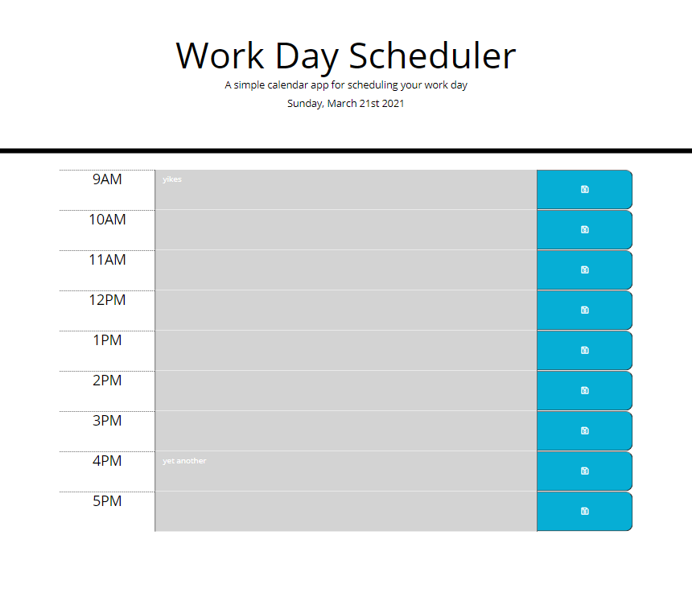

# Work Day Scheduler

## Description

Lightweight application that allows a user to save their schedule for the day in intuitive, color coded time blocks

## Intended Interface

## Usage

* Time blocks are sorted from 9am to 5pm in 1 hour increments
* Time blocks are color coded according to past, present, and future events
* Custom information is saved locally when user presses "save" icon  
